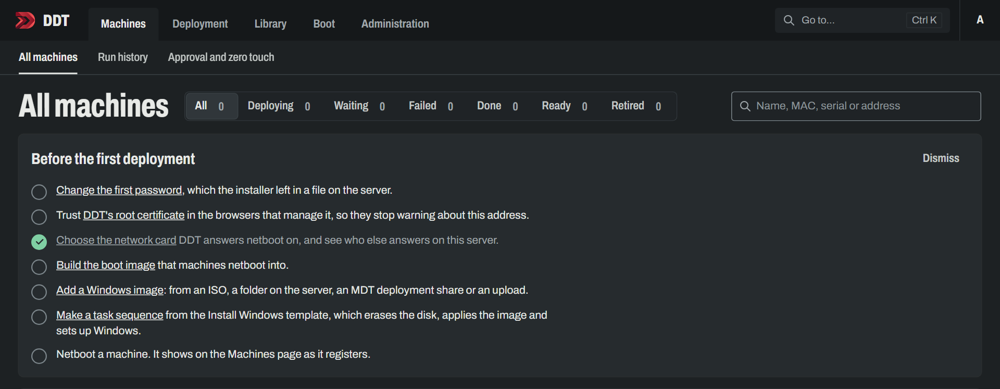

<picture>
  <source media="(prefers-color-scheme: dark)" srcset="src/DDT.Design/brand/readme-banner-dark.png">
  <source media="(prefers-color-scheme: light)" srcset="src/DDT.Design/brand/readme-banner-light.png">
  
</picture>

<div align="center">

# DDT, the Davicloud Deployment Toolkit

**Bare metal in, finished Windows out. Self-hosted, open source, and friends with Secure Boot.**

[](https://github.com/Davicloud-NET/DDT/actions/workflows/ci.yml)
[](LICENSE)

</div>

Microsoft retired the Deployment Toolkit in January 2026. DDT is here to take its place: a
self-hosted replacement for MDT, made for networks of 10 to 100 machines, even when they are spread
over a few sites and a VPN.

Plug a PC into the network and let it netboot. DDT takes it from there: it starts Windows PE, runs
a task sequence that partitions the disk and applies Windows (or writes a Linux image), carries on
inside the freshly installed Windows, and reports every step live to your browser. You get to drink
your coffee.

> [!NOTE]
> **The documentation is still thin.** There is a quick start right below, and a guide for people
> [coming from MDT](docs/coming-from-mdt.md). Everything else arrives with M12. Need the
> nitty-gritty right now? The
> [old README](https://github.com/Davicloud-NET/DDT/blob/b8f9f1a2a686a03ec450a5d0ff82b211d57a3ab3/README.md)
> still lives in the history: 2,346 lines of very thorough, very robotic prose. You have been warned.

## Quick start

You need three things: a Windows Server (2019 or later; Windows 10 and 11 do the job too) or a
Linux box with Docker, a Windows ISO, and a PC you don't mind erasing.

**On Windows**, in an elevated PowerShell:

```powershell
irm https://github.com/Davicloud-NET/DDT/releases/latest/download/install.ps1 | iex
```

Not a fan of piping scripts into a shell? Fair enough. Grab `DDT.msi` from the
[releases](https://github.com/Davicloud-NET/DDT/releases) and double-click it. Its setup asks for
the port and the network card, and offers to fetch the Windows ADK while it is at it.

**On Linux**, with Docker Engine and its compose plugin already installed:

```bash
curl -fsSL https://github.com/Davicloud-NET/DDT/releases/latest/download/install.sh | sudo sh
```

> [!IMPORTANT]
> DDT's releases are pre-releases for now, and GitHub's `latest` skips those, so both lines answer
> with a 404 until the first full release. Take `install.ps1` or `install.sh` from the newest entry
> on the [releases page](https://github.com/Davicloud-NET/DDT/releases) instead. Each copy installs
> the release it came with.

Either way you end up with an address, and with a file that holds the first password. Open the
address, sign in as `admin`, and the Machines page hands you a to-do list:



Work through it from the top. Most of it is one click each:

- **The network card.** The MSI's setup has asked already. After the PowerShell line, pick the card
  your machines sit on under *Boot, Network boot*. Until you do, DDT answers no netboot at all,
  which is on purpose.
- **The boot image.** On Windows, *Boot, Boot image* builds it with one button, and installs the ADK
  first if the server has none. A Linux server cannot run the ADK, so the same page gives you a zip
  instead: unpack it on any Windows PC that has the ADK, run `Build.cmd`, and it uploads the result
  by itself.
- **A Windows image.** Drop an ISO onto *Library, OS images*. DDT digs the `install.wim` out of it.
- **A task sequence.** *Deployment, Task sequences, New task sequence*, and start from
  **Install Windows**.
- **A machine.** Netboot it (F12 on most), sign in at its console with your DDT account and pick
  the sequence.

Then go and get that coffee. On the test VMs the whole trip, from the install command to a fresh
Windows 11 asking whom it belongs to, took under eleven minutes.

Two things that save an afternoon:

- **Trying it in Hyper-V?** Keep the server VM off the Default Switch. That switch's built-in DHCP
  went quiet for every VM on it once DDT answered a netboot from one of them. Give the lab a switch
  and a DHCP server of its own; the server VM can run the DHCP role itself.
- **Is MDT, WDS or a DHCP server already on that server?** DDT can live next to all three. The
  [guide for MDT users](docs/coming-from-mdt.md) says how.

## What it does

- **Netboots with what you already have.** PXE with ProxyDHCP and TFTP, right next to the DHCP
  server you run today. No custom bootloader and no switching Secure Boot off: DDT serves
  Microsoft's own signed boot manager from the Windows ADK and does its magic after that.
- **Runs task sequences.** Partition, apply an image, inject drivers, write the answer file, run
  scripts, join a domain, and restart as often as it takes, in Windows PE and in the installed
  Windows. You draw them as a flow, with IF branches, loops, groups and pauses, and conditions on the
  machine's model, memory, TPM or network. Rules pick the sequence for a machine and fill in values
  such as its name or time zone, a sequence can ask its questions on the web or at the machine, and
  a step can use an account whose password its script never sees.
- **Does Linux, too.** Raw disk images (raw, gzip, zstd, xz or qcow2) with a cloud-init seed,
  written from the very same Windows PE. One agent, one boot path.
- **Has a web UI that stays live.** Changes show up the moment they happen, no reload button
  required. Light and dark, English and German, and it fits on a phone, for approving a machine
  from the couch.
- **Puts a console at the machine.** A graphical console in Windows PE lets a technician sign in,
  pick a sequence and watch it run. Shift+F10 still gets you a command prompt.
- **Is secure by default.** HTTPS only, with DDT's own root certificate. A machine gets no image,
  package or secret until it is authorized: by someone signing in at it, by an approval on the web,
  or by a zero-touch network you chose. Local accounts, LDAP and OpenID Connect, two-factor
  sign-in, roles and API tokens.
- **Builds its own boot image.** On the server, with the server's address, its certificate and the
  drivers you flagged, and it tells you when the image has gone stale. It stays lean, too: about
  305 MB, roughly a third smaller than a typical MDT LiteTouchPE.
- **Installs with one command.** An MSI and a Windows service on Windows Server, one container on
  Linux. The database is a SQLite file until you point DDT at PostgreSQL or SQL Server.
- **Gets along with what MDT left behind.** It sits in the WDS boot menu next to LiteTouch, keeps
  out of the way of a DHCP server on the same machine, and takes the images and drivers out of a
  deployment share.

## How DDT is built

A lot of DDT's source code, including the tests, is written using AI, more specifically Claude Opus
and Fable. I exclusively decide what DDT actually does, how it works, what it will look like, its
security guidelines and its roadmap. I plan each milestone, review every code change and read all
documentation changes, and test every feature and system on virtual and physical hardware before
pushing it.

The repository also uses automated bots to help me manage this big project. All pull requests are
appropriately reviewed by a human before merging.

The logo and any product art included inside of this repository are fully drawn by humans or
sourced from humans. Once the CLA is in place, AI assistance in PRs is fully welcome under the rules
of [CONTRIBUTING.md](CONTRIBUTING.md)!

Who helps with what:

| Helper | What it does here |
|---|---|
| Claude Code, with Claude Opus and Claude Fable | Writes much of the code and the tests |
| Dependabot | Opens pull requests for package updates |
| GitHub code scanning and Copilot Autofix | Looks for security issues and suggests fixes |
| CodeRabbit | Reviews pull requests |

## Where it's at

DDT is young, and what it publishes for now are pre-releases. It has deployed Windows and Linux to
Hyper-V test machines and netbooted real hardware, but treat it as a preview.

| | Milestone | |
|---|---|---|
| M0 to M4 | The foundations: sign-in, PXE and TFTP, the agent, images and deployment | ✅ Done |
| M5 | Task sequences, in Windows PE and in the installed Windows | ✅ Done |
| M6 | Linux raw disk images | ✅ Done |
| M6.5 | The real UI: a new web UI, the graphical console, settings on web pages | ✅ Done |
| M6.6 | Installing DDT with one command, on Windows Server and on Linux | ✅ Done |
| M7 | A node-based flow builder for task sequences | ✅ Done |
| M8 | Runs that carry on inside the installed Linux | 🔜 Next |
| M9 | Applications and Windows configuration | Planned |
| M10 | Golden images and the machine lifecycle | Planned |
| M11 | Beyond netboot and beyond a single site | Planned |
| M12 | Documentation, the proper kind | Planned |

The [roadmap](docs/roadmap.md) has the details, and what is not planned at all.

## Building it yourself

Running DDT no longer takes a compiler, see the quick start. This part is for working on it. You
will want:

- the .NET SDK 10.0.201 or a later 10.0 feature band, and Node.js 24 LTS;
- Docker, for the container and for the PostgreSQL and SQL Server tests;
- the Visual Studio C++ build tools, for the NativeAOT agent;
- the Windows ADK with its WinPE add-on, 10.1.26100.2454 or later, for the boot image.

Run the whole development stack, server and web UI, through Aspire. On its first start the server
writes the first administrator's password to `first-admin.txt` in its store, and logs where that is.

```bash
dotnet run --project src/DDT.AppHost
```

Or build the container and run it with PostgreSQL next to it:

```bash
docker build -f build/Dockerfile -t ddt:dev .
echo "DDT_DB_PASSWORD=$(openssl rand -hex 24)" > build/.env
docker compose -f build/compose.yaml up
```

Netbooting real machines needs a Linux host for the container, because Docker Desktop does not pass
DHCP broadcasts through, and a boot image built on Windows with `build/Build-BootImage.ps1`.
[CONTRIBUTING.md](CONTRIBUTING.md) says how to run the tests.

## Contributing

Bug reports and feature ideas are very welcome as
[issues](https://github.com/Davicloud-NET/DDT/issues). Pull requests from outside have to wait for
the contributor licence agreement, which is in the works. [CONTRIBUTING.md](CONTRIBUTING.md) has
the details. Found a security hole? Please report it privately, as [SECURITY.md](SECURITY.md)
explains. Everyone who takes part follows the [code of conduct](CODE_OF_CONDUCT.md).

## Licence

DDT is free software under the [GNU General Public License, version 3 or later](LICENSE), with a
few additional terms under its section 7 in [NOTICE](NOTICE). In short, if you pass on DDT or a
work based on it:

- keep the attribution "DDT, the Davicloud Deployment Toolkit. Copyright (C) 2026 Davicloud." and
  the copyright notices intact, including in the legal notices the program shows;
- do not present it as your own work;
- mark a modified version as modified.

Running DDT inside your own organisation, changed or not, comes with no duties at all.
Distributing it, as source, as a container image, as an agent or in a boot image, means passing on
its source code and its notices: LICENSE, NOTICE, [THIRD-PARTY-NOTICES.md](THIRD-PARTY-NOTICES.md)
and `licenses/`. NOTICE also permits conveying the console together with Avalonia, which contains
code under a licence the GPL does not otherwise get along with. The Windows PE and ADK files in a
boot image are Microsoft's: you bring them from your own ADK, and DDT's licence does not cover them.
