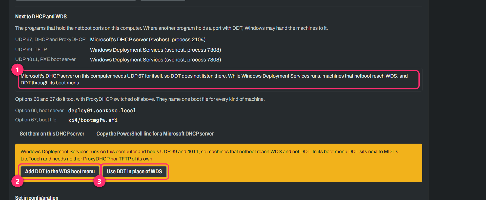
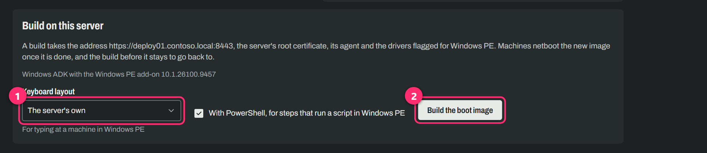
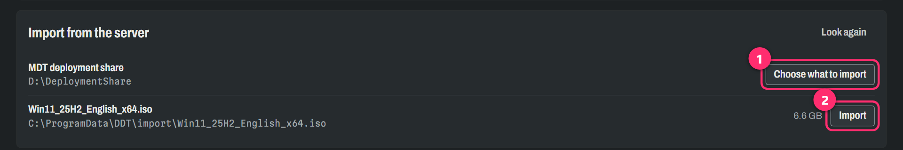
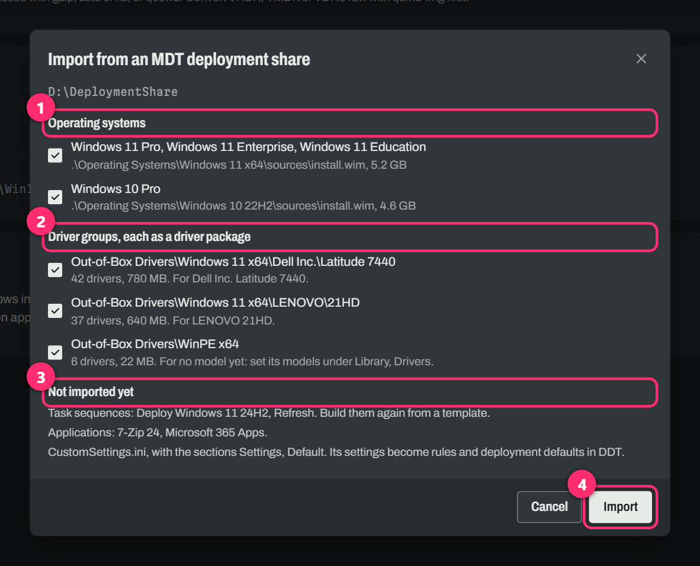
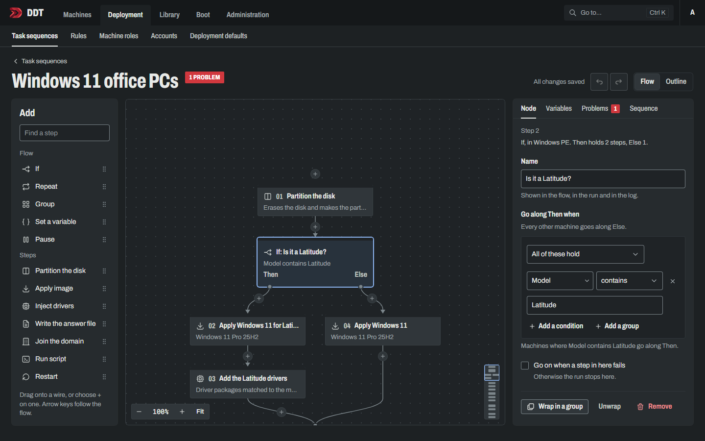
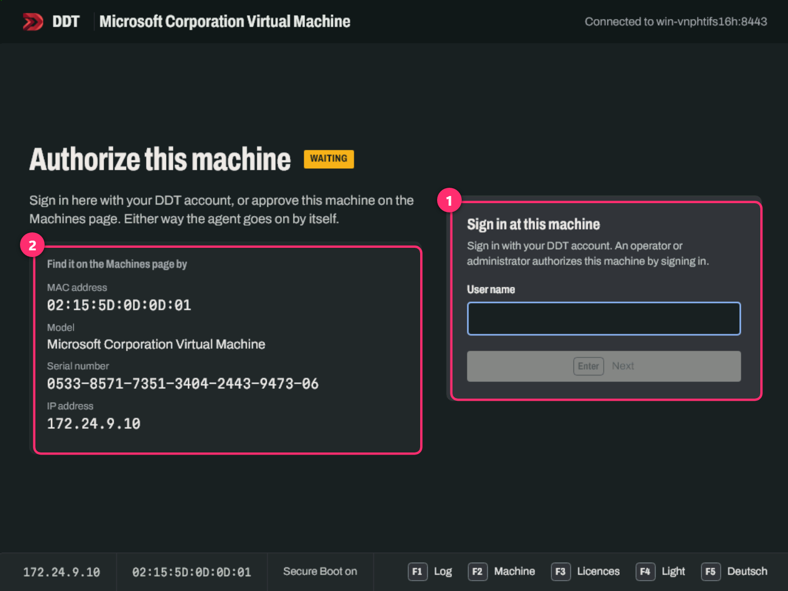
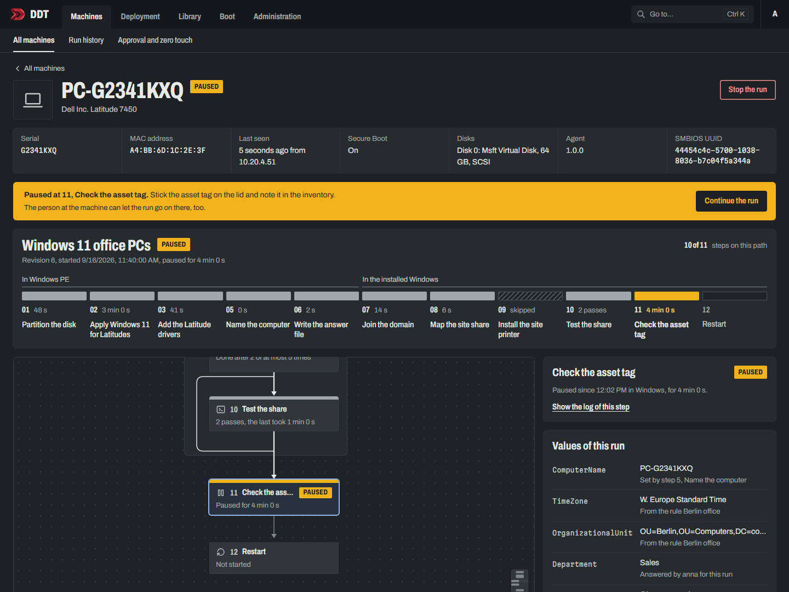

# Coming from MDT

So the Deployment Workbench is gone, and you still have machines to build. This page is for you. It
says where the things you know from MDT live in DDT, how to try DDT on the server you already have
without taking LiteTouch away from anyone, and what DDT cannot do for you yet.

It assumes you have deployed with MDT before, so nobody is going to explain PXE to you. If you just
want DDT running on an empty server, the [quick start](../README.md#quick-start) is the shorter
read. The pictures here show sample data; your server names will be nicer.

## The dictionary

| In MDT | In DDT |
|---|---|
| The deployment share | The library: *Library* with *OS images*, *Drivers* and *Files* |
| `LiteTouchPE_x64.wim` | The boot image, under *Boot, Boot image* |
| Update Deployment Share | The button **Build the boot image** |
| A selection profile for WinPE drivers | **Add to the Windows PE boot image**, on a driver package |
| Out-of-Box Drivers, sorted by make and model | Driver packages, each with the models it is for |
| The Standard Client Task Sequence | The template **Install Windows** |
| `CustomSettings.ini` | Rules, and *Deployment, Deployment defaults* |
| `Bootstrap.ini` | Nothing. The boot image knows its server |
| The Deployment Wizard | The console at the machine |
| Monitoring | The machine's page, live |
| WDS, for PXE | DDT itself, or your WDS if you would rather keep it |

The rest of this page goes through those in the order you will meet them.

## Try it next to MDT first

You do not have to choose on day one. DDT installs on the very server that runs MDT and WDS. It
listens on port 8443, keeps its things in `C:\ProgramData\DDT`, and does not touch the deployment
share. The one thing to watch during the install: **do not give DDT a network card for netboot
yet**. WDS already answers PXE on that server, and two answers to one question help nobody. The
PowerShell line leaves the card out unless you name one. The MSI's setup suggests a card, so pick
*No network card yet, I'll pick one in DDT* from its list.

Once it runs, sign in and open *Boot, Network boot*. Near the bottom, DDT tells you who holds the
netboot ports on the server and what it can do about it:



1. If Microsoft's DHCP server runs on the same machine, DDT says so and leaves UDP 67 to it. There
   is nothing for you to do here while WDS is in charge.
2. **Add DDT to the WDS boot menu** is the one you want. It puts DDT's boot image into WDS next to
   your LiteTouch images, so the F12 menu offers both. Build a boot image first (next chapter), or
   there is nothing to add. From then on DDT swaps the entry whenever you build a new image.
3. **Use DDT in place of WDS** is for the day you are sure. More on that at the end.

Both buttons ask for your password again. They change what every machine on the network boots, and
DDT would rather be certain it is you.

That is the whole trial setup: your technicians press F12, see the menu they know with one more
line in it, and the brave ones pick DDT.

## The boot image

MDT made you regenerate the boot image whenever something in it changed, and it did not always say
when. DDT has the same job and a page for it:



1. The keyboard layout is the one people type with at the machine, in Windows PE. It defaults to the
   server's.
2. **Build the boot image** takes two to three minutes. Machines netboot the new image as soon as it
   is done, and the build before it is kept, in case the new one turns out to be a mistake.

A few things work differently from LiteTouch:

- **There is no `Bootstrap.ini`.** The image carries the server's address and DDT's root
  certificate, and the agent in it trusts that server and no other.
- **The page tells you when to build again.** New WinPE drivers, a new server name or port, a new
  root certificate, another ADK: it shows a notice and says which it was. A newer agent is not
  among them, because the agent updates itself when it starts.
- **WinPE drivers are a switch, not a selection profile.** Under *Library, Drivers*, a driver
  package has **Add to the Windows PE boot image**. Flick it for the storage and network drivers a
  machine needs before it can see its disk or the network, and build again.
- **DDT wants a recent ADK**, the 10.1.26100 one that came with Windows 11 24H2. On a server
  without an ADK the page installs it for you. On a server with an older one, which an MDT server
  may well have, it says so and asks you to replace it. If you would rather not touch the ADK that
  MDT lives on, use **Build on another PC** instead: a zip you unpack on any Windows PC with a
  current ADK. `Build.cmd` in it builds the image and uploads it by itself.

## Bringing the deployment share along

DDT reads a deployment share and takes two things out of it: the operating systems and the
Out-of-Box Drivers. It only reads. Nothing in the share is changed, and MDT keeps working with it.

DDT imports from folders it has been told about, so tell it once. Add this to
`C:\ProgramData\DDT\ddt.ini` and restart the service `DDT`:

```ini
[DDT:ImportFolders]
0 = D:\DeploymentShare
```

(Yes, a file. It is the one place in this guide where DDT still wants one, and it is on the list.)

Then open *Library, OS images*:



1. The share shows up by its path. **Choose what to import** opens the list below.
2. While you are here: any ISO, WIM or ESD you copy into `C:\ProgramData\DDT\import` shows up in
   the same panel, with an **Import** button of its own. For a Windows ISO, DDT finds the
   `install.wim` inside by itself.



1. **Operating systems.** One line per image file, with the editions in it. The file is copied
   into the library once, and each edition becomes an image you can pick in a task sequence.
2. **Driver groups.** Each folder of Out-of-Box Drivers that holds drivers becomes a driver
   package. If you sorted them the usual way, by make and model, DDT reads the model out of the
   folder name and the package is matched to those machines from then on. A folder DDT cannot make
   sense of, like `WinPE x64`, comes over without a model; set one under *Library, Drivers*, or
   flag it for the boot image if that is what it was for.
3. **Not imported yet.** DDT lists what it found and leaves behind, so nothing vanishes silently:
   task sequences, applications and `CustomSettings.ini`. The next chapters say what to do about
   the first and the last.
4. **Import** starts the copying. A full share takes a while, mostly for reading gigabytes of WIM.

## Task sequences

MDT's task sequences do not come across, and honestly, rebuilding the usual one takes less time
than explaining an importer would. Under *Deployment, Task sequences*, choose **New task
sequence** and start from **Install Windows**. That gives you the heart of the Standard Client
Task Sequence: partition the disk, apply the image, add the drivers for the model, write the answer
file. If a domain is set in the deployment defaults, joining it is in there too.

From there on it is a flow you draw rather than a tree you fold open:



Steps go on a wire. An **If** splits it, say on the model or on how much memory a machine has. A
**Repeat** goes round until a script succeeds, and a **Pause** waits for a person. The steps
themselves are on the left, and most of their names you know already. A run carries on from
Windows PE into the installed Windows, restarts included, the way you are used to.

Two things in that picture are worth a second look. The red badge next to the name is the editor
checking the sequence while you draw it, so it complains before a machine does. And if you miss the
tree, **Outline** at the top right shows the same sequence as a list.

## CustomSettings.ini

This is the part to redo by hand, because DDT splits what MDT kept in one file.

**What is the same for every machine** goes into *Deployment, Deployment defaults*: language,
keyboard and time zone, the local administrator, and the domain with its join account and
organisational unit. That is your `[Default]` section.

**What depends on the machine** becomes a rule, under *Deployment, Rules*. A rule has a condition
on what the machine reports (its model, its serial number, its subnet or default gateway, whether
it is a laptop) and does two things with the machines it matches: it can pick their task sequence,
and it can set values such as `ComputerName`, `TimeZone` or `OrganizationalUnit`. If you had
sections per model or per default gateway, each of them turns into a rule. A name like
`PC-%SerialNumber%` becomes `PC-{{SerialNumber}}`.

Values that always travel together, say everything that makes a PC a kiosk, can go into a machine
role under *Deployment, Machine roles*, and a rule then hands out the role instead of five values.

Rules are checked from the top, and the first one to set a value wins, much like the `Priority`
line. The Rules page lets you try a machine against them and shows which rules matched and where
each value came from, which beats reading `BDD.log` backwards.

## At the machine

The Deployment Wizard is now a console that starts in Windows PE:



1. A technician signs in with their DDT account, picks a task sequence and answers what it asks.
   That sign-in is also what authorizes the machine. Until someone vouches for it, a machine gets
   no image and no secret, however politely it netboots.
2. The other way round works too. The machine shows up on the Machines page under this MAC address
   and serial number. Approve it there with a sequence, and it starts without anyone touching its
   keyboard.

DDT accounts can be local ones, or your Active Directory through LDAP, so technicians sign in with
the password they already have. That is under *Administration, Sign-in*. And if you want real zero
touch, *Machines, Approval and zero touch* takes a list of networks whose machines deploy without
a sign-in. Give those machines a rule that picks their sequence, and they need nobody at all.

## Watching it run

MDT's monitoring told you a step number and a percentage, on a good day. A machine's page in DDT
shows the run as it happens: every step with its time, the flow with the path this machine took,
the values it ran with and where each of them came from, and the log of every step.



You can stop a run from here, or let a paused one go on. Nobody has to press reload for any of it.

## What DDT cannot do yet

Better you hear it here than find out on a Friday afternoon:

- **Applications.** There is no application library yet, and no bundles. A Run script step can
  bring a zip from *Library, Files* along and install what is in it, and that is all for now.
  Applications are the heart of milestone M9, together with Windows Update and BitLocker.
- **Importing task sequences and `CustomSettings.ini`.** You rebuild them, as described above.
- **Refresh and replace.** No USMT yet, so DDT erases the disk and installs. That comes with M10.
- **Capturing a reference image.** Also M10. Until then, capture the way you do today and import
  the WIM.
- **Offline media.** No USB sticks yet; machines netboot. M11.
- **BIOS and 32-bit machines.** Not planned at all. Windows 11 wants UEFI and x64, and so does DDT.

The [roadmap](roadmap.md) has the rest.

## Going all in

When the last LiteTouch deployment is behind you, go back to *Boot, Network boot*:

- Choose the network card under **Interfaces**, so DDT answers netboot itself.
- Press **Use DDT in place of WDS**. DDT stops WDS and keeps it from starting with Windows. WDS
  stays installed, and **Start WDS again** on the same page brings it back if you change your mind.
- If the DHCP server runs on that machine too, there is nothing more to do in most cases: WDS will
  have set DHCP option 60 back when it was installed, and that option now leads machines to DDT.
  The page shows whether the option is there, and has a button for it if it is not.
- If your DHCP server is a router or a firewall somewhere else, DDT simply answers next to it. It
  hands out no addresses. It only tells a netbooting machine which file to load.

One warning for the lab, since it cost us an hour: do not test any of this on Hyper-V's Default
Switch. Its built-in DHCP stopped answering every VM on the switch as soon as DDT answered a
netboot there. Give your test VMs a switch and a DHCP server of their own.
